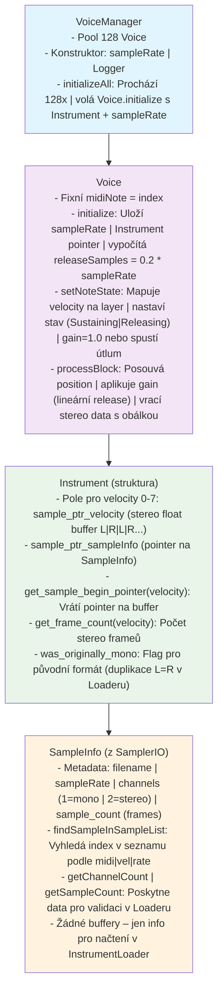

# IthacaCore: C++ Sampler s Loggerem a InstrumentLoader

## Popis projektu
IthacaCore je profesionální audio sampler engine napsaný v C++17. Systém je modulární, s podporou logování (Logger), prohledávání WAV sample souborů (SamplerIO), načítání do paměti jako stereo float buffery (InstrumentLoader) a koordinaci celého workflow (runSampler). **NOVÉ: Přidána podpora pro voice management (Voice a VoiceManager) pro polyfonní přehrávání s obálkou a stavy (idle, attacking, sustaining, releasing).** Navržen pro snadnou integraci do větších projektů, jako je audio plugin nebo standalone aplikace. Používá libsndfile pro práci s WAV soubory a podporuje parsování názvů souborů ve formátu `mXXX-velY-fZZ.wav` (kde XXX je MIDI nota 0-127, Y je velocity 0-7, ZZ je zkrácená frekvence s 'f' prefixem).

Klíčové vlastnosti:
- Thread-safe logování do souboru
- Prohledávání metadat (frekvence, MIDI nota, velocity, délka, počet kanálů) z WAV souborů
- **NOVÉ: Automatické načítání všech samples do paměti jako stereo interleaved float buffery**
- **NOVÉ: Mono→Stereo konverze s duplikací dat (L=R) pro jednotný formát**
- **NOVÉ: JUCE-ready buffer layout [L1,R1,L2,R2...] pro optimální audio processing**
- Detekce audio formátu (interleaved/non-interleaved) a potřeby konverze do float
- Analýza subformátu (16-bit PCM, 24-bit PCM, 32-bit float, atd.)
- Validace konzistence frekvence mezi názvem souboru a obsahem
- Vyhledávání sample podle MIDI noty a velocity
- Přístup k metadatům přes bezpečné gettery (s kontrolou indexu)
- **NOVÉ: Automatická validace stereo konzistence všech načtených bufferů**
- **NOVÉ: Simulace JUCE AudioBuffer pro stereo výstup bez závislosti na JUCE**
- Žádné konzolové výstupy v modulech – vše logováno
- Detekce mono/stereo formátu a další audio metadata
- **NOVÉ: Polyfonní voice management s obálkou (attack/release) a stavy**

## Požadavky
- Visual Studio Code
- Visual Studio 2022 Build Tools (s C++ komponentami) nebo Community Edition
- CMake (verze 3.10+, přidejte do PATH)
- Rozšíření VS Code: CMake Tools a C/C++ od Microsoftu
- libsndfile (stáhne se automaticky přes `add_subdirectory` v CMakeLists.txt)
- C++17 kompatibilní kompilátor (MSVC/GCC/Clang)

## Postup nastavení
1. Uložte všechny soubory do kořenové složky projektu (např. `IthacaCore`)
2. Vytvořte složku `.vscode` a uložte do ní `tasks.json`, `launch.json` a `settings.json`
3. Vytvořte složku `libsndfile` a stáhněte do ní zdrojový kód libsndfile (nebo použijte externí build)
4. Otevřete projekt v VS Code (File → Open Folder)
5. Spusťte CMake: Configure (Ctrl+Shift+P → CMake: Configure). To vygeneruje build soubory v `build` složce

## Sestavení a spuštění
- **Sestavení**: Spusťte úlohu "build" (Ctrl+Shift+P → Tasks: Run Task → build). To nastaví prostředí MSVC přes `vcvars64.bat` a spustí `cmake --build .`. Vytvoří `Debug/IthacaCore.exe`
- **Spuštění**: Klikněte na tlačítko spustit (|> ) nebo stiskněte F5. Program se sestaví a spustí
- **Výstup**:
  - Na konzoli: Úvodní zpráva "[i] Starting IthacaCore" a případně parametry
  - V logu (`core_logger/core_logger.log`): Záznamy o inicializaci loggeru, prohledávání sample, **NOVÝCH operacích InstrumentLoader (načítání do paměti, mono→stereo konverze, validace)**, **NOVÝCH operacích Voice/VoiceManager (inicializace voice, setNoteState, processBlock)**, vyhledávání (např. "Loaded: m108-vel7-f44.wav (MIDI: 108, Vel: 7, Freq: 44100 Hz, Duration: 2.5s, Channels: 2 (stereo), Frames: 110250, Format: interleaved, needs float conversion)")
- **Čištění**: Smažte složku `build` a `core_logger` pro reset

**Poznámka**: Cesta k `vcvars64.bat` v tasks.json je pro VS 2022 Build Tools. Pokud máte Community, upravte na `C:\Program Files\Microsoft Visual Studio\2022\Community\VC\Auxiliary\Build\vcvars64.bat`. Pro PowerShell execution policy: `Set-ExecutionPolicy RemoteSigned -Scope CurrentUser`.

## Použití v vlastním projektu
Pro integraci do vašeho C++ projektu zahrňte hlavičky a linkujte libsndfile. Příklad minimálního použití (v main.cpp):
```cpp
#include "core_logger.h"
#include "sampler.h"
#include "instrument_loader.h"
#include "voice.h"           // NOVÉ: Pro Voice a VoiceManager
#include "voice_manager.h"   // NOVÉ: Pro polyfonní management
int main() {
    Logger logger("./"); // Cesta k logům
    int result = runSampler(logger); // Spustí celý workflow včetně InstrumentLoader a VoiceManager
    return result;
}
```
Pro vlastní logiku použijte třídu `SamplerIO` (pro IO operace) a **NOVOU třídu `InstrumentLoader`** (pro načítání do paměti). **NOVÉ: Pro přehrávání použijte `Voice` a `VoiceManager` pro polyfonii.** Vždy inicializujte `Logger` pro logování.

### Použití třídy SamplerIO
`SamplerIO` pro čisté IO operace (prohledávání, vyhledávání, přístup k metadatům). Vytvořte instanci a předejte logger.

| Metoda | Parametry | Příklad | Komentář | Návratový typ | Příklad návratu / Chyba |
|--------|-----------|---------|----------|---------------|-------------------------|
| `SamplerIO()` | - | `SamplerIO io;` | Konstruktor: Inicializuje prázdný seznam `sampleList`. Žádné logování v konstruktoru. | `void` (konstruktor) | - (žádný návratový kód, úspěšná inicializace) |
| `~SamplerIO()` | - | Automatický | Destruktor: Žádné speciální akce (seznam se uvolní automaticky). | `void` (destruktor) | - (automatické uvolnění) |
| `scanSampleDirectory(const std::string& directoryPath, Logger& logger)` | `directoryPath` – cesta k adresáři se WAV soubory (např. `"./samples"`), `logger` – reference na Logger | `io.scanSampleDirectory(R"(c:\samples)", logger);` | Prohledá adresář. Deleguje parsování názvů (regex), načte metadata (libsndfile). Validuje konzistenci frekvence mezi názvem a souborem. Detekuje formát (interleaved) a potřebu konverze (PCM→float). Loguje info/warn/error. Chyby (neexistující adresář, nekonzistentní frekvence): zaloguje a `std::exit(1)`. | `void` | - (úspěch: načte data; chyba: exit(1) po logu) |
| `findSampleInSampleList(uint8_t midi_note, uint8_t velocity, int sampleRate) const` | `midi_note` (0-127), `velocity` (0-7), `sampleRate` (frekvence v Hz) | `int idx = io.findSampleInSampleList(60, 5, 44100);` | Vyhledá index sample v interním seznamu. Vrátí -1, pokud nenalezeno. Lineární prohledávání, žádné logování. | `int` | `0` (index první shody); `-1` (nenalezeno, není chyba) |
| `getLoadedSampleList() const` | - | `const auto& list = io.getLoadedSampleList();` | Vrátí konstantní referenci na vektor `SampleInfo` pro čtení metadat. Žádné logování. | `const std::vector<SampleInfo>&` | Reference na vektor (prázdný, pokud není načteno) |

### **NOVÉ: Použití třídy InstrumentLoader**
`InstrumentLoader` pro načítání WAV samples do paměti jako 32-bit stereo float buffery optimalizované pro JUCE. **Klíčová nová funkcionalita:**

#### **Hlavní vlastnosti:**
- **Povinná stereo konverze**: Všechny samples (i původně mono) jsou uloženy jako stereo `[L1,R1,L2,R2...]`
- **Mono→Stereo duplikace**: Mono samples se automaticky duplikují do obou kanálů (L=R)
- **JUCE-ready formát**: Buffer layout optimalizovaný pro JUCE AudioBuffer de-interleaving
- **Automatická validace**: Kontrola konzistence všech načtených bufferů
- **Filtrování frekvence**: Načítá pouze samples s požadovanou frekvencí vzorkování

| Metoda | Parametry | Příklad | Komentář | Návratový typ |
|--------|-----------|---------|----------|---------------|
| `InstrumentLoader(SamplerIO& sampler, int targetSampleRate, Logger& logger)` | `sampler` – reference na SamplerIO, `targetSampleRate` – požadovaná frekvence (např. 44100), `logger` – reference na Logger | `InstrumentLoader loader(sampler, 44100, logger);` | Konstruktor: Inicializuje pole pro všechny MIDI noty 0-127. Loguje inicializaci s targetSampleRate. | `void` (konstruktor) |
| `loadInstrument()` | - | `loader.loadInstrument();` | **HLAVNÍ METODA**: Načte všechny dostupné samples do paměti jako stereo float buffery. Prochází všechny MIDI noty 0-127 a velocity 0-7. Provádí mono→stereo konverzi. Validuje konzistenci po načtení. Loguje progress a statistiky. | `void` |
| `getInstrumentNote(uint8_t midi_note)` | `midi_note` (0-127) | `Instrument& inst = loader.getInstrumentNote(108);` | Vrátí referenci na Instrument strukturu pro danou MIDI notu. Kontroluje platnost rozsahu. Při chybě: log error a exit(1). | `Instrument&` |
| `getTotalLoadedSamples()` | - | `int total = loader.getTotalLoadedSamples();` | Getter pro celkový počet úspěšně načtených samples. | `int` |
| `getMonoSamplesCount()` | - | `int mono = loader.getMonoSamplesCount();` | Getter pro počet původně mono samples (před konverzí na stereo). | `int` |
| `getStereoSamplesCount()` | - | `int stereo = loader.getStereoSamplesCount();` | Getter pro počet původně stereo samples. | `int` |
| `getTargetSampleRate()` | - | `int rate = loader.getTargetSampleRate();` | Getter pro nastavenou target sample rate v Hz. | `int` |

#### **NOVÁ struktura Instrument s API metodami:**
```cpp
struct Instrument {
    // Existující pole
    SampleInfo* sample_ptr_sampleInfo[8];    // pointery na SampleInfo
    float* sample_ptr_velocity[8];           // pointery na stereo float buffery
    bool velocityExists[8];                  // indikátory existence
    
    // NOVÁ metadata
    sf_count_t frame_count_stereo[8];        // počet stereo frame párů
    sf_count_t total_samples_stereo[8];      // celkový počet float hodnot (frame_count * 2)
    bool was_originally_mono[8];             // původní formát před konverzí
    
    // NOVÉ API metody pro přístup k stereo datům
    float* get_sample_begin_pointer(uint8_t velocity);    // pointer na stereo data [L,R,L,R...]
    sf_count_t get_frame_count(uint8_t velocity);         // počet stereo frame párů
    sf_count_t get_total_sample_count(uint8_t velocity);  // celkový počet float hodnot
    bool get_was_originally_mono(uint8_t velocity);       // původní formát info
};
```

#### **Příklad kompletního použití s InstrumentLoader:**
```cpp
Logger logger("./");
SamplerIO sampler;
std::string dir = R"(c:\Users\jindr\AppData\Roaming\IthacaPlayer\instrument)";

// 1. Prohledání adresáře
sampler.scanSampleDirectory(dir, logger);

// 2. NOVÉ: Načtení všech samples do paměti jako stereo buffery
InstrumentLoader loader(sampler, 44100, logger);
loader.loadInstrument();  // Automatická mono→stereo konverze a validace

// 3. NOVÉ: Přístup k načteným stereo datům
Instrument& inst = loader.getInstrumentNote(108);
if (inst.velocityExists[7]) {
    // Získání stereo dat ready pro JUCE
    float* stereoData = inst.get_sample_begin_pointer(7);      // [L1,R1,L2,R2...]
    sf_count_t frames = inst.get_frame_count(7);               // počet stereo párů
    sf_count_t totalSamples = inst.get_total_sample_count(7);  // celkový počet float hodnot
    bool wasMono = inst.get_was_originally_mono(7);            // původní formát
    
    // Pro JUCE AudioBuffer de-interleaving:
    /*
    AudioBuffer<float> juceBuffer(2, frames); // 2 kanály
    float* leftChannel = juceBuffer.getWritePointer(0);
    float* rightChannel = juceBuffer.getWritePointer(1);
    
    for (int frame = 0; frame < frames; frame++) {
        leftChannel[frame] = stereoData[frame * 2];     // L kanál
        rightChannel[frame] = stereoData[frame * 2 + 1]; // R kanál
    }
    */
}

// 4. NOVÉ: Statistiky načítání
logger.log("demo", "info", "Total loaded: " + std::to_string(loader.getTotalLoadedSamples()));
logger.log("demo", "info", "Originally mono: " + std::to_string(loader.getMonoSamplesCount()));
logger.log("demo", "info", "Originally stereo: " + std::to_string(loader.getStereoSamplesCount()));
```

### **NOVÉ: Použití třídy Voice a VoiceManager**
`Voice` reprezentuje jednu hlasovou jednotku pro přehrávání sample s obálkou (attack/release) a stavy (idle, attacking, sustaining, releasing). `VoiceManager` spravuje pool voice pro polyfonii (např. 128 hlasů). Používá simulaci `AudioBuffer` pro stereo výstup bez závislosti na JUCE.

#### **Hlavní vlastnosti:**
- **Polyfonie**: VoiceManager přiřazuje MIDI noty k volným voices.
- **Obálka**: Jednoduchá time-based gain (release 200 ms).
- **Stavy**: Enum `VoiceState` pro řízení lifecycle (startNote/stopNote).
- **AudioBuffer**: Simulace JUCE bufferu pro výstup [left, right].
- **AudioData**: Struktura pro jeden stereo sample.

#### **Tabulka metod Voice:**
| Metoda | Parametry | Příklad | Komentář | Návratový typ |
|--------|-----------|---------|----------|---------------|
| `Voice()` | - | `Voice voice;` | Default konstruktor: Inicializuje idle stav (pro pool v VoiceManager). | `void` (konstruktor) |
| `Voice(uint8_t midiNote, Logger& logger)` | `midiNote` (0-127), `logger` | `Voice voice(60, logger);` | Konstruktor pro VoiceManager: Nastaví MIDI notu, instrument později přes initialize. | `void` (konstruktor) |
| `Voice(uint8_t midiNote, const Instrument& instrument, Logger& logger)` | `midiNote`, `instrument`, `logger` | `Voice voice(60, inst, logger);` | Plný konstruktor: Inicializuje s instrumentem. | `void` (konstruktor) |
| `initialize(const Instrument& instrument)` | `instrument` | `voice.initialize(inst);` | Inicializuje s instrumentem (pro pool). | `void` |
| `cleanup()` | - | `voice.cleanup();` | Reset na idle stav. | `void` |
| `reinitialize(const Instrument& instrument)` | `instrument` | `voice.reinitialize(inst);` | Reinicializuje s novým instrumentem. | `void` |
| `setNoteState(bool isOn, uint8_t velocity = 0)` | `isOn` (true/false), `velocity` (0-127) | `voice.setNoteState(true, 100);` | Nastaví stav: true = startNote, false = stopNote. | `void` |
| `advancePosition()` | - | `voice.advancePosition();` | Posune pozici o 1 frame (pro non-real-time). | `void` |
| `getCurrentAudioData() const` | - | `AudioData data = voice.getCurrentAudioData();` | Vrátí stereo sample (left/right) s gainem. | `AudioData` |
| `processBlock(AudioBuffer& outputBuffer, int numSamples)` | `outputBuffer`, `numSamples` | `voice.processBlock(buf, 512);` | **HLAVNÍ METODA**: Zpracuje blok, aplikuje obálku, zapisuje do bufferu. Vrátí true, pokud aktivní. | `bool` |
| `getMidiNote() const` | - | `uint8_t note = voice.getMidiNote();` | Getter pro MIDI notu. | `uint8_t` |
| `isActive() const` | - | `if (voice.isActive()) { ... }` | Kontroluje aktivitu (gate on nebo releasing). | `bool` |

#### **Příklad použití VoiceManager:**
```cpp
Logger logger("./");
InstrumentLoader loader(sampler, 44100, logger);
loader.loadInstrument();

// NOVÉ: Inicializace VoiceManager (pool 128 voice)
VoiceManager manager(128, logger);
manager.initializeAll(loader);  // Inicializuje voices s instrumenty

// Nastavení noty (note-on pro MIDI 60, velocity 100)
manager.setNoteState(60, true, 100);

// Procesování audio bloku (simulace JUCE processBlock)
AudioBuffer output(512);  // Stereo buffer pro 512 samples
if (manager.processBlock(output, 512)) {
    // Výstup v output.leftChannel a output.rightChannel
    // Např. pro JUCE: Přidej do reálného AudioBuffer
}

// Note-off
manager.setNoteState(60, false);
```

### Funkce runSampler
- **Signatura**: `int runSampler(Logger& logger)`
- **Příklad**: `runSampler(logger);`
- **Komentář**: **AKTUALIZOVÁNO**: Spustí kompletní workflow včetně nového InstrumentLoader. Deleguje prohledávání do SamplerIO, **inicializuje InstrumentLoader, načte všechny samples do paměti jako stereo buffery**, **NOVÉ: Inicializuje VoiceManager, nastaví test notu (MIDI 108/vel 7), procesuje blok s obálkou a loguje stavy**. **Testuje nové API metody get_sample_begin_pointer(), get_frame_count() atd. i processBlock pro Voice**. Loguje všechny kroky včetně detailních informací o stereo konverzi a JUCE-ready formátu. Vrátí 0 při úspěchu (chyby končí `std::exit(1)`). Použijte pro standalone test s plnou funkcionalitou.

## Struktura projektu
### Klíčové soubory
- **CMakeLists.txt**: Definuje projekt, přidává libsndfile, linkuje soubory (`main.cpp`, `sampler/*.cpp`) a include cesty. **AKTUALIZOVÁNO**: Přidány `instrument_loader.h/cpp`, `voice.h/cpp`, `voice_manager.h/cpp`.
- **main.cpp**: Hlavní vstup – inicializuje logger, zpracuje argumenty a volá `runSampler`.
- **sampler/core_logger.h/cpp**: Implementace třídy `Logger`.
- **sampler/sampler.h/cpp**: Deklarace a implementace funkce `runSampler` a třídy `SamplerIO`.
- **sampler/sampler_io.cpp**: Implementace SamplerIO metod.
- **sampler/instrument_loader.h/cpp**: **NOVÉ**: Implementace třídy `InstrumentLoader` pro načítání do paměti.
- **sampler/voice.h/cpp**: **NOVÉ**: Implementace třídy `Voice` pro hlasovou jednotku s obálkou a stavy.
- **sampler/voice_manager.h/cpp**: **NOVÉ**: Implementace třídy `VoiceManager` pro polyfonní management.
- **sampler/wav_file_exporter.h/cpp**: Export WAV pro testování.
- **.vscode/**: Konfigurace pro VS Code (build tasky, launch, settings pro terminal a file associations).
- **README.md**: Tento soubor.

### **NOVÉ: Struktury a třídy**
#### Struktura `SampleInfo` (v `sampler.h`) - NEZMĚNĚNO
Uchovává metadata o WAV samplu - bez změn, podle freeze requirement.

#### **NOVÁ struktura `Instrument` (v `instrument_loader.h`)** - BEZ ZMĚN
Reprezentuje jeden MIDI note s velocity vrstvami a **novými stereo metadaty** (viz výše).

#### **NOVÁ třída `InstrumentLoader` (v `instrument_loader.h/cpp`)** - BEZ ZMĚN
Centralizuje načítání WAV samples do paměti s klíčovými vlastnostmi (viz výše).

#### **NOVÉ třídy `Voice` a `VoiceManager` (v `voice.h/cpp` a `voice_manager.h/cpp`)**
- `Voice`: Spravuje jednu notu s obálkou, stavy a přístupem k stereo bufferům. Podporuje metody pro inicializaci, setNoteState a processBlock.
- `VoiceManager`: Pool voice pro polyfonii, inicializuje voices, nastavuje stavy a procesuje bloky.
- **Simulace JUCE**: `AudioBuffer` pro výstup, `AudioData` pro sample data.

#### Třída `Logger` (v `core_logger.h/cpp`) - NEZMĚNĚNO
Zůstává stejná jako před aktualizací.

## Řešení problémů
- **Execution Policy**: Spusťte `Set-ExecutionPolicy RemoteSigned -Scope CurrentUser` v PowerShell.
- **libsndfile chybí**: Stáhněte z [libsndfile GitHub](https://github.com/libsndfile/libsndfile) a upravte CMakeLists.txt.
- **Linkovací chyba LNK1104**: Ukončete všechny procesy IthacaCore.exe, smažte build složku a sestavte znovu.
- **Logy**: Sledujte `core_logger/core_logger.log`. Pro real-time: `Get-Content -Path "core_logger/core_logger.log" -Tail 10 -Wait`.
- **Rozšíření**: Upravte cestu v `sampler.cpp` pro jiné samples. **NOVÉ: Pro práci s načtenými buffery použijte InstrumentLoader API; pro přehrávání VoiceManager**.
- **Chyba - nekonzistence frekvence**: Program se ukončí s chybou, pokud frekvence v názvu souboru neodpovídá frekvenci v WAV headeru.
- **Nepodporovaný subformát**: Program končí s chybou při detekci nepodporovaného audio formátu.
- **NOVÉ - Validace stereo**: Program končí s chybou při selhání validace stereo konzistence v InstrumentLoader.
- **NOVÉ - Chyba v Voice**: Pokud instrument není inicializován, processBlock vrátí false (log warning).

## Poznámky
- **Názvosloví souborů**: Samples musí mít formát `mXXX-velY-fZZ.wav` (XXX = MIDI nota 0-127, Y = velocity 0-7, ZZ = zkrácená frekvence s 'f' prefixem: f8, f11, f16, f22, f44, f48, f88, f96, f176, f192). Jinak se ignorují s warningem.
- **Validace**: Frekvence v názvu (fZZ) musí odpovídat frekvenci v WAV headeru, jinak program končí s chybou.
- **NOVÉ - Stereo formát**: **Všechny buffery jsou vždy uloženy jako stereo interleaved [L,R,L,R...] bez ohledu na původní formát**.
- **NOVÉ - Mono konverze**: **Mono samples se automaticky duplikují do stereo formátu (L=R)** pro jednotnost.
- **NOVÉ - JUCE optimalizace**: **Buffer layout je optimalizovaný pro JUCE AudioBuffer de-interleaving**.
- **Detekce formátu**: Program analyzuje, zda je WAV interleaved (standard) a jaký má subformát (16-bit PCM, float, atd.).
- **Podporované formáty**: 16-bit PCM, 24-bit PCM, 32-bit PCM, 32-bit float, 64-bit double.
- **Optimální formát**: 32-bit float (žádná konverze potřebná).
- **NOVÉ - Paměťové nároky**: **Paměťové nároky jsou vyšší - všechny samples jsou uloženy jako stereo float buffery**.
- **Chyby**: Selhání inicializace (adresář, přístup, neplatný index v gettech, nekonzistentní frekvence, nepodporovaný formát, **validace stereo**, **neinicializovaný instrument v Voice**) vede k logu a `std::exit(1)`.
- **Thread-safety**: Pouze logování je chráněno mutexem; sampler není navržen pro multi-threading.
- **NOVÉ - Rozšířená metadata**: Program nyní prohledává a poskytuje přístup k délce, počtu kanálů, stereo detekci, počtu vzorků, formátu, potřebě konverze a **novým stereo metadatům**.
- **NOVÉ - Validace integrity**: **Automatická validace konzistence všech načtených stereo bufferů**.
- **NOVÉ - Voice stavy**: Použijte `isActive()` pro kontrolu, `processBlock` pro renderování.
- **Projekt je přenositelný**: Pro složitější aplikace přidejte JUCE nebo další knihovny.

## **NOVÉ: JUCE Integrace**
InstrumentLoader poskytuje perfektní integraci s JUCE AudioBuffer. **NOVÉ: Voice procesuje do simulovaného AudioBuffer, který lze snadno převést do reálného JUCE bufferu.**

```cpp
// Získání stereo dat z InstrumentLoader
Instrument& inst = loader.getInstrumentNote(midiNote);
if (inst.velocityExists[velocity]) {
    float* stereoData = inst.get_sample_begin_pointer(velocity);  // [L,R,L,R...]
    sf_count_t frameCount = inst.get_frame_count(velocity);
    
    // De-interleaving pro JUCE AudioBuffer
    AudioBuffer<float> juceBuffer(2, frameCount);
    float* leftChannel = juceBuffer.getWritePointer(0);
    float* rightChannel = juceBuffer.getWritePointer(1);
    
    for (int frame = 0; frame < frameCount; frame++) {
        leftChannel[frame] = stereoData[frame * 2];         // L kanál
        rightChannel[frame] = stereoData[frame * 2 + 1];    // R kanál
    }
}

// NOVÉ: Použití s Voice pro obálku
Voice voice(midiNote, inst, logger);
voice.startNote(velocity);
AudioBuffer simBuf(512);  // Simulace pro test
voice.processBlock(simBuf, 512);  // Aplikován gain, výstup v simBuf
// Převeď simBuf do JUCE bufferu
```
---



---

# Vysvětlení frames, samples a bytes v audio kontextu

V audio zpracování (např. v JUCE nebo libsndfile) se tyto termíny používají pro popis velikosti a struktury audio dat. Vysvětlení v kontextu stereo interleaved formát [L,R,L,R...]:

- **Frames**: Časová jednotka audio signálu, která obsahuje data pro **všechny kanály v jednom okamžiku**. Pro mono = 1 frame = 1 sample. Pro stereo (2 kanály) = 1 frame = 2 samples (levý + pravý). V logu: **529200 frames** znamená délku zvuku v časových bodech (např. při 44.1 kHz sample rate = ~12 sekund).

- **Samples**: Nejmenší jednotka daty – jedna hodnota pro jeden kanál v jednom časovém bodě. V multi-kanálovém audio (stereo) se "total samples" sčítá přes všechny kanály. V logu: **1058400 total samples** = 2 kanály × 529200 frames (každý frame má 2 samples).

- **Bytes**: Celková velikost dat v paměti (v bytech). Závisí na bitové hloubce (např. float = 4 bytes na sample). V logu: **4233600 bytes** = 1058400 samples × 4 bytes (pravděpodobně 32-bit float). To je pro interleaved formát, kde data jsou propletená (L,R,L,R...), takže buffer zabere tolik místa.

---

# Helper commands

## Grab-Files
```
PowerShell.exe -ExecutionPolicy Bypass -File .\Grab-Files.ps1
```

## Watch log
```
Get-Content -Path "./core_logger/core_logger.log" -Tail 10 -Wait
```

## Git submodule init
```
git submodule update --init --recursive
```

## Pridani submodulu rucne
```
git submodule add https://github.com/libsndfile/libsndfile libsndfile
```
